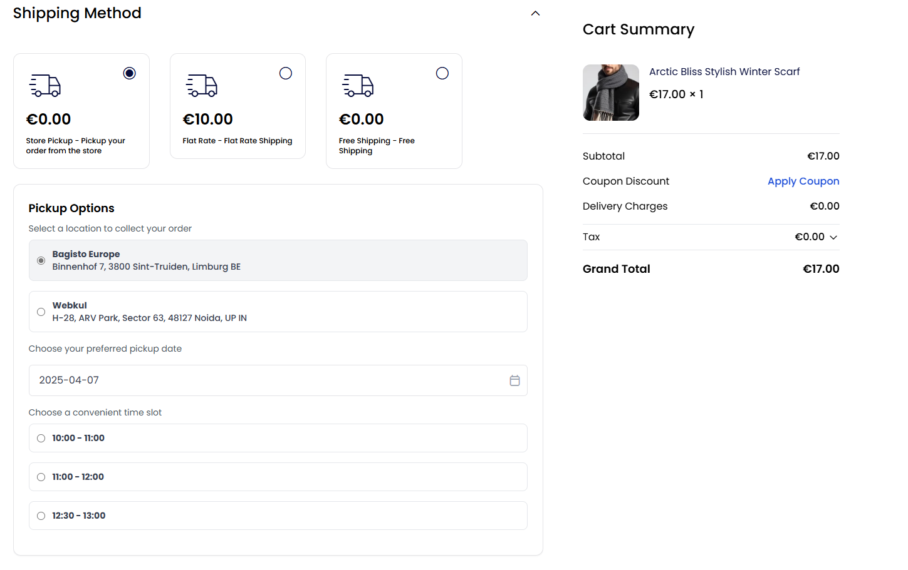

<p align="center">
    
    <h2 align="center">Bagisto Pickup</h2>
</p>

<p align="center">
     
</p>



## Features
- Allows customers to select a pickup location during checkout.
- Provides available pickup timeslots based on the selected date.
- Handles inventory source validation to ensure products are available at the selected pickup location.

## Installation
To install the package, you need to add it to your Bagisto project using Composer.

### Step 1: Install the Package
```bash
composer require bagisto-eu/pickup
```

### Step 2: Install the Package with Artisan Command

```bash
php artisan pickup:install
```

This command will handle publishing views and translation files, and any necessary assets.

## Timeslots configuration
To manage the timeslots go to the admin panel -> Settings -> Pickup Timeslots
